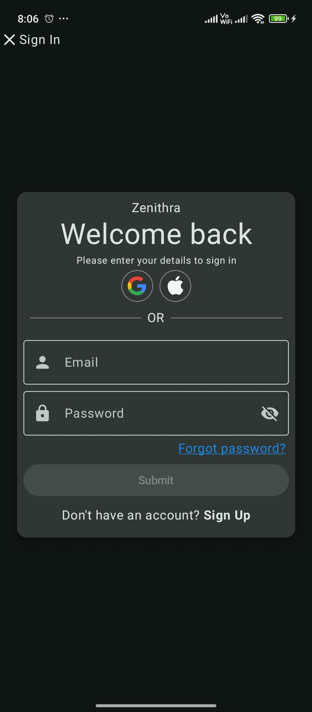
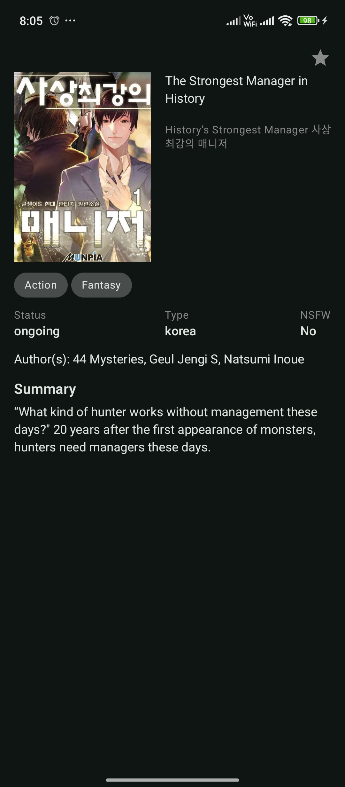
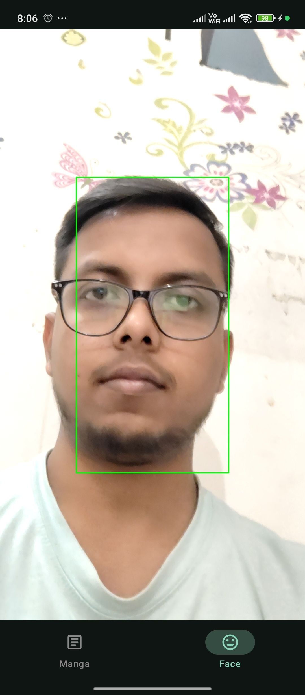

# Scanime 📱

An Android app to browse and explore manga content. Built using Jetpack Compose, Room, Retrofit, and Coil.

---

## 🔥 Features
- Sign In / Sign Up with email & password
- Home screen with manga listing
- Shared element transitions between screens
- Caching with Room DB + offline support
- **Face Detection Integration** using MediaPipe

---

## 📸 Screenshots

| Sign In | Home | Details | Face Detect |
|--------|------|---------|--------|
|  |  |  |  |

---

## 🎥 Demo Video

[Watch Demo on Google Drive](https://drive.google.com/file/d/1n8s4qRZ9HLp005bvu3RWokfHwgiCCKhT/view?usp=drive_link)

---

## 📦 Download APK

[Download APK from Google Drive](https://drive.google.com/file/d/1Eb1q6Z38yLc7vx45sk-oZt313nEELo84/view?usp=drive_link)

